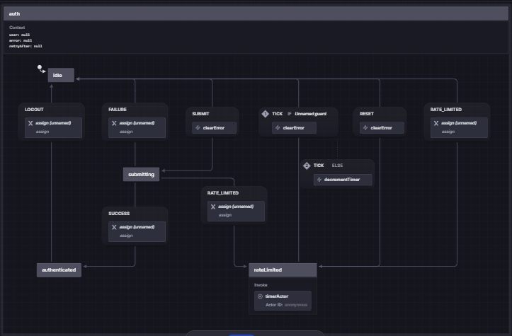
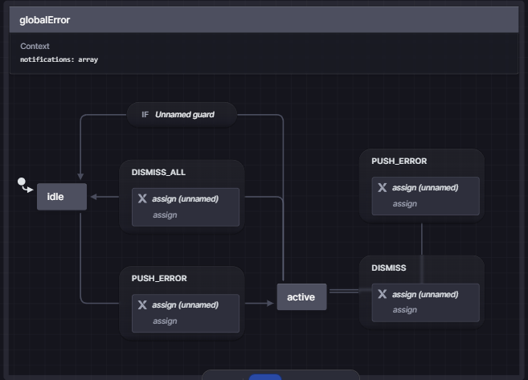
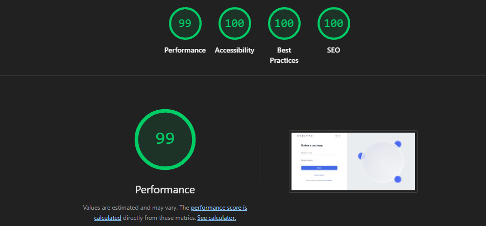

# Orbitto Auth Frontend

Привет! Я Александр, и я представляю вам свой проект системы авторизации, разработанный в рамках инженерного челленджа Atlantis. Основной целью этого проекта было показать не просто качественную верстку, а полноценное архитектурное решение, способное надежно работать с реальным backend-сервисом в условиях высоких требований к безопасности и UX.

В этом проекте я сделал упор на три ключевых аспекта: инженерную зрелость (FSD), типобезопасность и управление сложными состояниями (XState v5).

**Backend Fork:** [Boolick/backend-engineer-challenge](https://github.com/Boolick/backend-engineer-challenge)
*Обоснование выбора:* Данный бэкенд полностью соответствует критериям `backend-engineer-challenge`, предоставляет прозрачный API-gate (gRPC + HTTP Gateway) и поддерживает Docker Compose, что гарантирует простоту запуска и надежность интеграции.


---

## 📋 Оглавление

1. [Ключевые особенности](#-ключевые-особенности)
2. [Технологический стек](#-технологический-стек)
3. [Архитектура и Паттерны](#-архитектура-и-паттерны)
4. [State Machine (XState)](#-state-machine-xstate)
5. [Безопасность и BFF](#-безопасность-и-bff)
6. [Предположения по backend-контрактам](#-предположения-по-backend-контрактам)
7. [Предварительные требования](#-предварительные-требования)
8. [Запуск проекта](#-запуск-проекта)
9. [Доступные скрипты](#-доступные-скрипты)
10. [Тестирование](#-тестирование)
11. [Инженерные решения и Trade-offs](#-инженерные-решения-и-trade-offs)
12. [Бонусные сигналы и осознанные границы](#-бонусные-сигналы-и-осознанные-границы)
13. [Следующие шаги (Production)](#-следующие-шаги-production)
14. [Ссылки и материалы](#-ссылки-и-материалы)

---

## ✨ Ключевые особенности

- **Полный Auth-флоу:** Регистрация, логин, запрос сброса и установка нового пароля по дизайну Orbitto Service.
- **Умное управление состояниями:** Конечные автоматы (XState v5) для обработки загрузки, ошибок и Rate Limiting (HTTP 429) с таймером обратного отсчета.
- **Безопасность:** Паттерн BFF через Next.js Route Handlers. Токены живут только в `HttpOnly` куках, фронтенд не имеет к ним прямого доступа (защита от XSS).
- **Интернационализация (i18n):** Поддержка русского и английского языков "из коробки" через `next-intl`.
- **Адаптивный UI/UX:** Анимации на базе Framer Motion, микроинтеракции (Floating Labels) и строгая валидация форм (Zod + React Hook Form).

---

## 🛠 Технологический стек

- **Фреймворк:** Next.js 16 (App Router)
- **Язык:** TypeScript 5
- **Управление состоянием:** XState v5
- **Стилизация:** Tailwind CSS v4, Class Variance Authority (CVA), clsx, tailwind-merge
- **Анимации:** Framer Motion
- **Работа с формами:** React Hook Form + Zod (@hookform/resolvers)
- **Интернационализация:** next-intl
- **Тестирование:** Vitest + React Testing Library (jsdom)
- **API Клиент:** TanStack React Query v5

---

## 🏗 Архитектура и Паттерны

Проект строго следует методологии **Feature-Sliced Design (FSD)**. Это позволяет избежать проблемы "всё в одной папке" и четко разграничить зоны ответственности:

### Структура директорий

```text
src/
├── app/                  # Next.js App Router, глобальные стили, Route Handlers (BFF)
│   └── api/auth/_lib/    # Централизованная нормализация ошибок бэкенда (map-error.ts)
├── widgets/              # Самостоятельные UI-блоки (например, auth-layout, dashboard-content)
├── features/             # Бизнес-сценарии (auth-by-email, i18n-toggle)
├── entities/             # Доменные сущности
│   ├── session/          # Auth-машина (XState), API-методы, типы
│   └── error/            # Глобальная error-машина (XState), типы ошибок, классификатор
└── shared/               # Переиспользуемый код (lib/cookie.ts, UI-kit, хуки)
```

### Data Flow (Жизненный цикл запроса)

1. Пользователь заполняет форму логина (валидация через `Zod`).
2. Событие `SUBMIT` уходит в XState-машину (`entities/session/model/auth.machine.ts`).
3. Машина переходит в состояние `submitting`, UI блокируется (loading-состояние).
4. Выполняется запрос к локальному Next.js Route Handler (`/api/auth/login`).
5. BFF-слой проксирует запрос на реальный Go-бэкенд (`http://localhost:8080/api/v1/auth/login`).
6. **При ошибке:** BFF нормализует ответ через `mapBackendError()` в канонический `NormalizedError` — клиент никогда не видит «сырую» форму ошибки бэкенда.
7. BFF получает ответ, устанавливает `HttpOnly` куки (`accessToken`, `refreshToken`) и возвращает пользователя на клиент.
8. Хук `useAuthByEmail` классифицирует ошибку (`classifyError`) и маршрутизирует:
   - `field` → `authMachine.FAILURE` (inline-сообщение под формой)
   - `toast`/`banner` → `errorMachine.PUSH_ERROR` (глобальное уведомление)
9. Машина переходит в `authenticated` (или `rateLimited`/`idle` в случае ошибки).

---

## 🚦 State Machine (XState)

Логика аутентификации слишком сложна для обычных `isLoading` и `isError`. Использование XState гарантирует, что UI никогда не окажется в неконсистентном состоянии.




**Основные состояния:**

- `idle`: Ожидание действий пользователя.
- `submitting`: Отправка данных на сервер (форма заблокирована).
- `authenticated`: Успешный вход в систему.
- `rateLimited`: Слишком много попыток. Запускается внутренний актор-таймер, отсчитывающий секунды до следующей попытки (события `TICK`), который отображается прямо в UI.

### Глобальная Error Machine (`entities/error/model/error.machine.ts`)




Вторая XState-машина, работающая параллельно с `authMachine`, отвечает за **глобальные ошибки** — те, которые не привязаны к конкретному полю формы (`backend_unavailable`, `rate_limited`, `unknown_error`). Это позволяет избежать добавления новых зависимостей (Zustand, Redux) — XState уже присутствует в проекте.

**Состояния:**

- `idle`: Очередь уведомлений пуста.
- `active`: Есть активные уведомления. Автоматически возвращается в `idle` при очистке очереди (guard-переход).

**Маршрутизация ошибок (Error Routing):**

```text
Ошибка от BFF          Классификатор            Destination
┌───────────────┐      ┌──────────────┐
│ code:          │──►  │ classifyError │
│ invalid_creds  │     │              │──► field  → authMachine.FAILURE (inline)
│ rate_limited   │     │              │──► toast  → authMachine + errorMachine (оба)
│ backend_unavail│     │              │──► banner → errorMachine.PUSH_ERROR (глобально)
└───────────────┘      └──────────────┘
```

**Архитектурное решение:** Ни одна дополнительная библиотека не была установлена. `errorMachine` монтируется в `providers.tsx` как синглтон и доступен через React Context (`useGlobalError`).

---

## 🛡 Безопасность и BFF

В проекте реализован паттерн **Backend-For-Frontend (BFF)**.
Отправка запросов напрямую на Go-бэкенд с клиента и хранение JWT в `localStorage` подвергает приложение XSS-атакам. Вместо этого используются серверные ручки Next.js.

- **Route Handlers (`src/app/api/auth/*`)**: Выступают как безопасный прокси, скрывая реальный URL бэкенда и обрабатывая токены.
- **Централизованная нормализация ошибок (`_lib/map-error.ts`)**: Единственное место в проекте, которое знает о «сыром» формате ошибок бэкенда. Все Route Handler'ы вызывают `mapBackendError()` → клиент получает каноническое `{ code, message, retryAfter?, status }`. Это делает клиент максимально тонким — он не содержит логики маппинга HTTP-статусов.
- **HttpOnly Cookies**: Токены сохраняются в защищенные куки (`Secure`, `SameSite=Lax`). Клиентский JS не может их прочитать.
- **Edge Middleware (`src/proxy.ts`)**: Защита приватных роутов (`/dashboard`) и редиректы происходят на уровне сервера, что исключает "мигание" контента.

---

## 📎 Предположения по backend-контрактам

Ниже перечислены допущения, на которые опирается frontend и которые нормализуются через BFF-слой. Они сверены со swagger backend (`engineer-challenge/docs/swagger/api/auth/v1/auth.swagger.json`):

- **Успешные ответы `login` и `password-reset/reset`** по swagger возвращают `{ session: { accessToken, refreshToken, expiresAt, user } }`. BFF сохраняет токены в `HttpOnly` cookies, а в клиентский слой отдает только `user`, потому что UI не должен зависеть от доступа к токенам.
- **Успешный `register`** по swagger возвращает `{ userId, session }`. Во frontend `userId` отдельно не используется, потому что достаточно `session.user.id`; это сознательное упрощение клиентского контракта без потери данных для auth-flow.
- **Неуспешные ответы** в swagger описаны как `rpcStatus` с полями `{ code, message, details }`. BFF читает прежде всего `message`, но дополнительно толерантен к полю `error` и в любом случае нормализует ошибку в единый `error`-payload для UI.
- **`password-reset/request`** по swagger возвращает `200` с пустым объектом. Поэтому фронтенд считает любой `2xx` успешным сценарием и не завязывается на текст или структуру success-body.
- **Rate limiting (`429`)** поддержан на уровне frontend как расширение контракта: если backend дополнительно передает `retryAfter`, UI запускает countdown; если поле отсутствует, используется fallback `60` секунд. В текущем swagger это поле не задокументировано, поэтому оно считается опциональным расширением.
- **Health-check** вынесен за пределы auth swagger и проверяется отдельным запросом на `/health`. Любой non-`2xx` или timeout трактуется как временная недоступность auth backend, из-за чего submit-действия блокируются заранее.

---

## 💻 Предварительные требования

- Node.js 20 или выше
- npm (или yarn/pnpm)
- Запущенный инстанс Go-бэкенда (см. [репозиторий бэкенда](https://github.com/Boolick/backend-engineer-challenge) для инструкций по запуску через Docker Compose).

---

## 🚀 Запуск проекта

### 1. Клонирование и установка зависимостей

```bash
git clone <url-вашего-форка>
cd frontend-engineer-challenge
npm install
```

### 2. Настройка окружения

Скопируйте пример файла конфигурации:

```bash
cp .env.example .env.local
```

Убедитесь, что переменные настроены правильно:

| Переменная    | Описание              | Значение по умолчанию   |
| ------------- | --------------------- | ----------------------- |
| `BACKEND_URL` | URL вашего Go-бэкенда | `http://localhost:8080` |

### 3. Запуск Development-сервера

```bash
npm run dev
```

Приложение будет доступно по адресу [http://localhost:3000](http://localhost:3000).

---

## 📜 Доступные скрипты

| Команда         | Описание                                         |
| --------------- | ------------------------------------------------ |
| `npm run dev`   | Запуск сервера для разработки с HMR              |
| `npm run build` | Сборка оптимизированного production-билда        |
| `npm run start` | Запуск production-сервера (после build)          |
| `npm run test`  | Запуск Unit и интеграционных тестов через Vitest |
| `npm run lint`  | Проверка кода статическим анализатором ESLint    |

---

## 🧪 Тестирование

Проект использует Vitest для проверки критичной бизнес-логики без запуска браузера.
Сейчас тестами покрыты два ключевых слоя: XState-машина авторизации и `src/proxy.ts`, который отвечает за серверные редиректы, защиту приватных роутов и корректную работу i18n-маршрутизации.
Такой набор дает быструю обратную связь по самым рискованным сценариям: таймеры rate limit, переходы состояний, доступ к `/dashboard`, редиректы на `/login` и поведение авторизованного пользователя на auth-страницах.

```bash
# Запуск тестов
npm run test
```

Пример из тестов (`src/entities/session/model/auth.machine.test.ts`):

```typescript
it("should transition to rateLimited and handle countdown timer correctly", () => {
  // ...
  expect(snapshot.value).toBe("rateLimited");
  expect(snapshot.context.retryAfter).toBe(3);

  vi.advanceTimersByTime(1000);
  expect(actor.getSnapshot().context.retryAfter).toBe(2);
});
```

Отдельно тест для `src/proxy.ts` проверяет:

- пропуск системных запросов и статики;
- возврат ответа `next-intl` для публичных страниц;
- редирект неавторизованного пользователя с `/dashboard` на `/login` с сохранением query-параметров;
- редирект авторизованного пользователя со страниц входа на `/dashboard`.

---

## ⚖️ Инженерные решения и Trade-offs

### 1. XState vs Zustand/Redux

**Решение:** Выбран XState для управления состоянием авторизации.
**Обоснование:** Флоу авторизации (особенно с учетом 429 Rate Limit и обратных отсчетов) имеет строгие дискретные состояния. Обычные сторы заставляют плодить флаги `isSubmitting`, `isError`, `isRateLimited`, что рано или поздно ведет к багам неконсистентности. XState решает это на уровне фундаментальной архитектуры.

### 2. BFF (Next.js API Routes) vs Прямые запросы к Go

**Решение:** Использование Next.js Route Handlers как прокси (BFF).
**Обоснование:** Прямые запросы с клиента требуют хранения JWT в памяти или `localStorage`, что небезопасно (XSS). BFF позволяет упаковать токены в `HttpOnly` куки на сервере Next.js, делая фронтенд максимально безопасным.
**Trade-off:** Дополнительный сетевой хоп (Client -> Next.js -> Go). Однако для авторизационных запросов задержка в 5-10мс абсолютно не критична по сравнению с колоссальным выигрышем в безопасности.

### 3. Tailwind v4 vs Styled Components / CSS Modules

**Решение:** Tailwind CSS v4.
**Обоснование:** Максимальная скорость разработки, отсутствие runtime-оверхеда (в отличие от CSS-in-JS), встроенная дизайн-система.

### 4. Дизайн-система vs Готовые библиотеки (MUI/AntD)

**Решение:** Собственный UI-kit (в `shared/ui`) на базе Radix UI (опционально) и Tailwind.
**Обоснование:** Дизайн Orbitto Service уникален. Использование тяжеловесных библиотек вроде MUI потребовало бы огромных усилий по переопределению стилей. Свой UI-kit дает полный контроль над пикселями и анимациями (Framer Motion).

### 5. Ограничение адаптивности (Trade-off)

**Trade-off:** UI полностью адаптирован под Mobile и Desktop, но сложные промежуточные брейкпоинты для нестандартных планшетов проработаны базово в угоду скорости реализации основного auth-флоу и сложной логики интеграции.

### 6. Offline-aware auth UX при недоступном backend

**Решение:** Введен явный health-gate между UI и BFF:

- `GET /api/auth/health` теперь возвращает `503` при `offline/error`, а не `200`.
- Формы авторизации проверяют health на маунте и перед submit.
- При недоступности backend кнопка submit блокируется, а пользователь сразу видит понятное сообщение о недоступности сервиса авторизации.
- Route Handlers (`login/register/password-reset`) при сетевой ошибке возвращают `503` + `backend_unavailable`, что устраняет "Internal Server Error" как единственный сценарий в UI.

**Обоснование:** Пользователь получает предсказуемое поведение и обратную связь до отправки данных, что снижает фрустрацию и количество ложных попыток входа.

### 7. Четырёхслойная обработка ошибок (4-Layer Error Defense)

**Решение:** Ошибки обрабатываются на 4 уровнях:

| Слой                    | Где                                                 | Ответственность                                     |
| ----------------------- | --------------------------------------------------- | --------------------------------------------------- |
| **BFF Normalization**   | `app/api/auth/_lib/map-error.ts`                    | Маппинг «сырых» backend-ответов в `NormalizedError` |
| **XState errorMachine** | `entities/error/model/error.machine.ts`             | Глобальная очередь уведомлений (toast/banner)       |
| **Error Router**        | `features/auth-by-email/model/use-auth-by-email.ts` | Классификация ошибок → `field`/`toast`/`banner`     |
| **UI Layer**            | `shared/ui/error/error-notification-layer.tsx`      | Анимированные уведомления с `aria-live`             |

### 8. Персистентный Rate-Limit Timer (Cookie Sync)

**Решение:** Чтобы таймер обратного отсчета не сбрасывался при обновлении страницы, смене языка или навигации, реализована синхронизация через Client-Accessible Cookie.

- **BFF (`map-error.ts`)**: При ошибке 429 устанавливает куку `auth_rate_limit_expiry` с временной меткой (ms) и `Max-Age`.
- **Hook (`useAuthByEmail.ts`)**: При монтировании проверяет наличие куки, вычисляет остаток времени и отправляет событие `RATE_LIMITED` в XState-машину.
- **XState**: Подхватывает значение и продолжает отсчет.

**Обоснование:** Это позволяет избежать использования `sessionStorage` и гарантирует, что пользователь видит _реальное_ время до следующей попытки, даже если он решил сменить язык перед повторным входом. Кука саморазрушается по истечении времени лимита.

---

## 🎯 Бонусные сигналы и осознанные границы

Ниже я фиксирую не только то, что уже реализовано, но и то, что сознательно не добавлял, чтобы не раздувать решение искусственно.

### Что уже есть в текущем решении

1. **Мини UI-kit / слой primitives:** в `shared/ui` вынесены базовые переиспользуемые примитивы (`Button`, `FloatingInput`) с едиными вариантами, loading-state, анимациями и консистентной стилизацией. Для объема челленджа это не полноценная дизайн-система, а намеренно компактный UI-layer, достаточный для масштабирования auth-flow.
2. **FSD с аргументацией границ:** структура `app / widgets / features / entities / shared` используется не формально, а по назначению. UI-композиция, сценарии, доменные сущности и инфраструктурный код разведены по слоям, чтобы проект не скатывался в `components/` и `services/` без ответственности.
3. **Практическое следование SOLID:** формы отвечают за ввод и отображение, `useAuthByEmail` — за orchestration сценариев, XState-машина — за допустимые переходы состояний, `sessionApi` — за транспорт, а BFF — за boundary между frontend и backend. Это упрощает замену деталей реализации без переписывания всего auth-flow.
4. **Типизация контрактов на прикладном уровне:** backend DTO зафиксированы в TypeScript-моделях и дополнительно нормализуются через BFF, чтобы клиентский UI не зависел напрямую от формы токенов и низкоуровневых различий ответов backend.
5. **Dual XState-машины для разделения ответственности:** `authMachine` управляет формой и auth-flow, `errorMachine` управляет глобальными уведомлениями. Машины работают независимо, но `useAuthByEmail` маршрутизирует ошибки между ними через `classifyError()`. Это даёт чёткое разделение между domain-ошибками ("неверный пароль") и infrastructure-ошибками ("бэкенд недоступен").
6. **Базовая наблюдаемость фронта:** глобальная `errorMachine` выступает как централизованный лог ошибок на уровне клиента. Каждая ошибка получает уникальный `id`, `code` и timestamp, что упрощает интеграцию с Sentry/OpenTelemetry в production-версии.

### Что сознательно не добавлялось

1. **Codegen / typed client:** для текущего объема auth API я сознательно не добавлял генерацию клиентов из swagger, чтобы не перегрузить решение инфраструктурой. Если бы API surface был шире или развивался несколькими командами, codegen стал бы следующим логичным шагом.
2. **Telemetry / error tracking:** в runtime-решение не включались Sentry/OpenTelemetry, потому что для челленджа важнее было показать устойчивость UX и корректную интеграцию с backend. При этом в production-версии observability я считаю обязательным следующим шагом.
3. **Микрофронты:** для локального auth-модуля это был бы неоправданный рост сложности. В данном контексте отказ от микрофронтов — осознанное инженерное решение, а не упущение.

### 4. Производительность и Vital Signs

Проект демонстрирует высокие показатели производительности благодаря использованию Next.js App Router, оптимизации ассетов и легковесных анимаций. Все ключевые метрики Core Web Vitals (LCP, FID, CLS) находятся в "зеленой зоне", что подтверждается аудитом Lighthouse.



---

## 🔮 Следующие шаги (Production)

Что бы я добавил перед реальным релизом в production:

1. **Observability (Sentry / OpenTelemetry):** Интеграция Sentry как стандарта де-факто для отлова клиентских исключений, мониторинга зависаний (Error Tracking). Если проект разрастется в полноценную сеть микросервисов, будет оправдано внедрить сквозную трассировку запросов между фронтендом и Go-микросервисами через OpenTelemetry.
2. **E2E Тестирование (Playwright/Cypress):** Покрытие критических пользовательских путей (регистрация -> логин -> логаут) в реальном браузере.
3. **Refresh Token Rotation Manager:** Реализация механизма автоматического (и бесшовного) обновления токенов (через `/api/auth/refresh`) в Edge Middleware при истечении `accessToken`.
4. **Улучшенная доступность (a11y):** Полный аудит скринридерами, улучшенное управление фокусом при переходах между состояниями и модалками.

---

## 🔗 Ссылки и материалы

- **Backend Fork:** [Boolick/backend-engineer-challenge](https://github.com/Boolick/backend-engineer-challenge)
